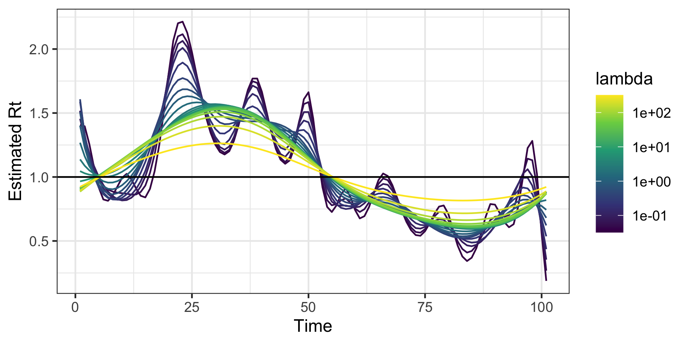

<!-- README.md is generated from README.Rmd. Please edit that file -->

# rtestim <a href="https://dajmcdon.github.io/rtestim/"></a>

<!-- badges: start -->

[](https://github.com/dajmcdon/rtestim/actions/workflows/R-CMD-check.yaml)
<!-- badges: end -->

This package uses Poisson likelihood with trend filtering penalty (a
type of regularized nonparametric regression) to estimate the effective
reproductive number, Rt. This value roughly says “how many new
infections will result from each new infection today”. Values larger
than 1 indicate that an epidemic is growing while those less than 1
indicate decline.

## Installation

You can install the development version of rtestim from
[GitHub](https://github.com/) with:

``` r
# install.packages("remotes")
remotes::install_github("dajmcdon/rtestim")
```

## Quick example

Here we create some data that “looks” like a typical wave in an
epidemic. Because the model uses regularized regression, we estimate the
model at a range of tuning parameters simultaneously.

``` r
set.seed(12345)
library(rtestim)
library(ggplot2)
dat <- data.frame(
  Time = 1:101,
  incident_cases = c(1, rpois(100, dnorm(1:100, 50, 15) * 500 + 1))
)
ggplot(dat, aes(Time, incident_cases)) +
  geom_point(colour = "cornflowerblue") +
  theme_bw()
```


We fit the model and visualize the resulting estimated sequences of
$R_t$:

``` r
mod <- estimate_rt(observed_counts = dat$incident_cases, nsol = 20)
plot(mod)
```



The additional parameter `nsol = 20` specifies the number of $\lambda$s
for which $R_t$ is estimated.

A built in function for cross-validation can be used to select the
tuning parameter.

``` r
mod_cv <- cv_estimate_rt(dat$incident_cases, nsol = 20)
plot(mod_cv, which_lambda = "lambda.1se")
```


