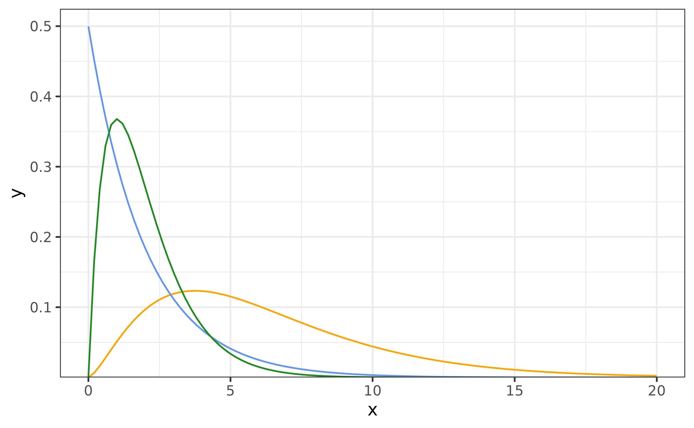
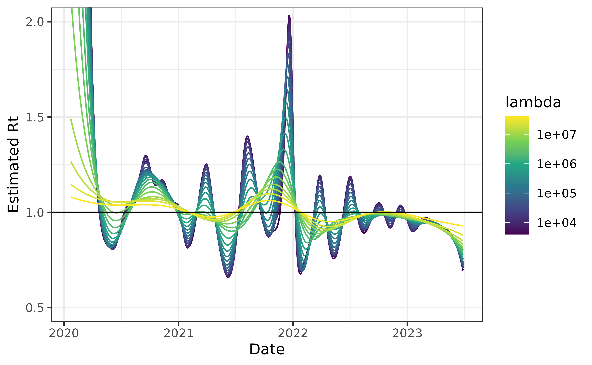
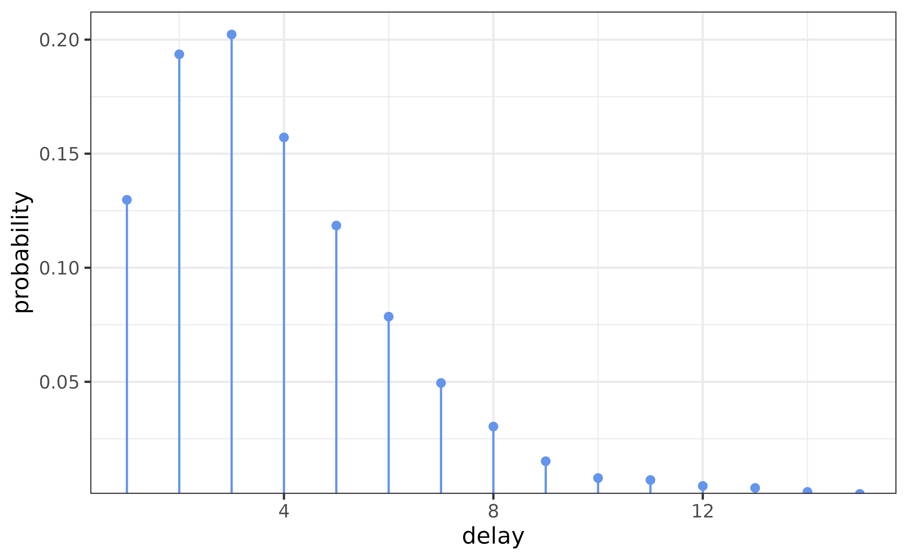
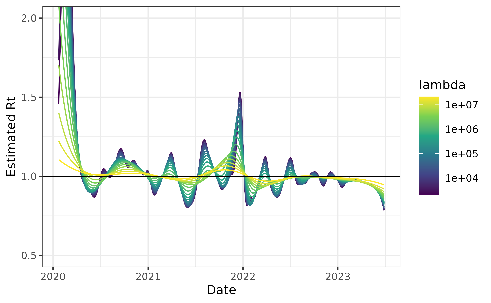
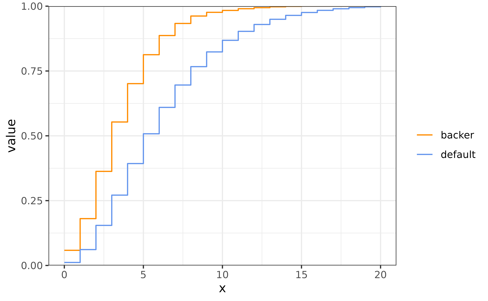
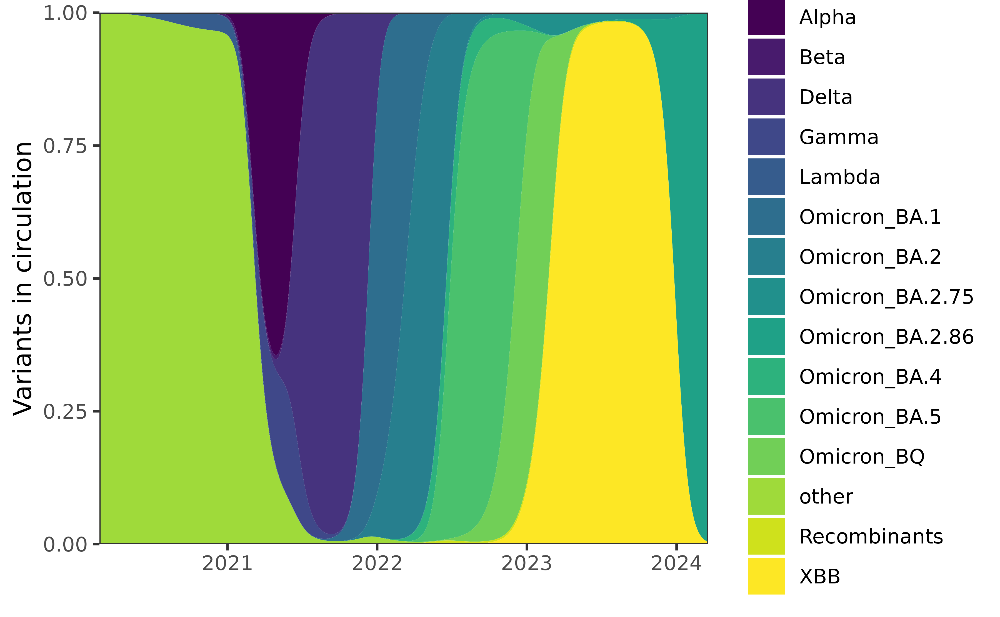
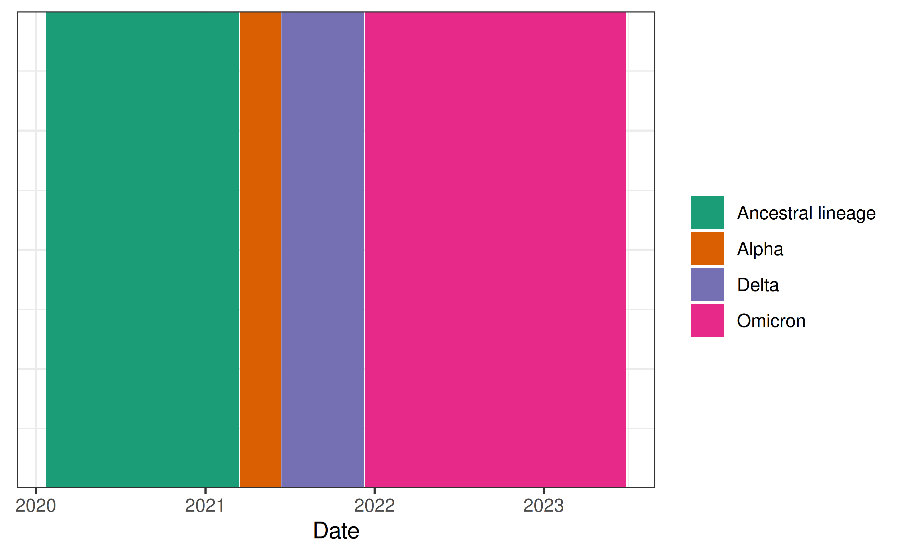
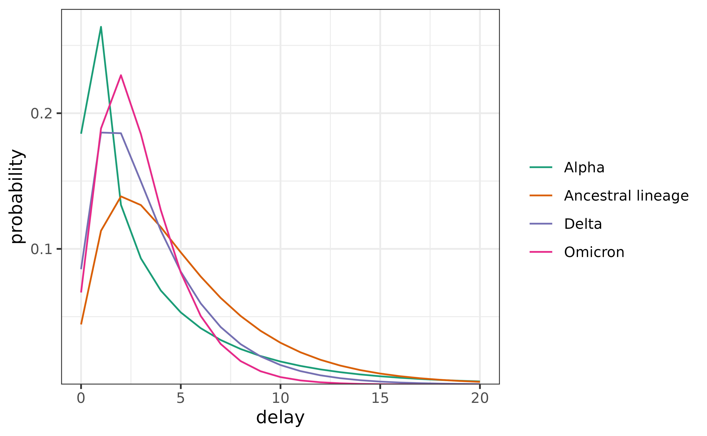
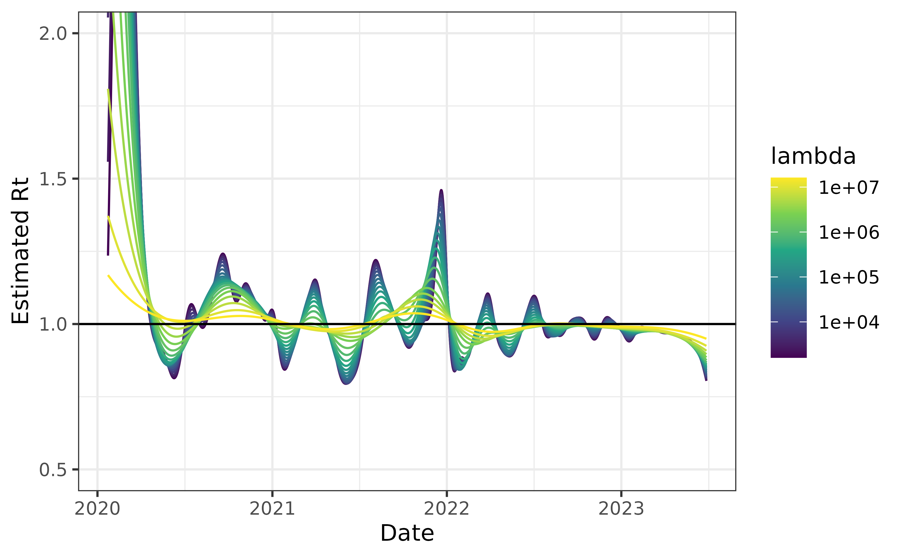

# Delay distributions

``` r

library(rtestim)
library(ggplot2)
library(dplyr)
library(nnet)
library(forcats)
library(tidyr)
library(Matrix)
theme_set(theme_bw())
```

This package accommodates 3 different ways of specifying a delay
distribution in the renewal equation, and this vignette illustrates
these in turn. The renewal equation specifies that the expected
incidence at time \\t\\ is a weighted sum of previous incidence,
multiplied by \\R_t\\: \\\begin{equation} \mathbb{E}\[I_t \mid
I_1,\ldots,I\_{t-1}\] = R_t \sum\_{a=0}^t w_a I\_{t-a}, \end{equation}\\
calculated by convolving the preceding \\a\\ days of new infections with
the discretized generation (or serial) interval distribution \\w\\ of
length \\t\\. It is the allowable distributions \\\\w\\\_{a=0}^n\\ that
are the focus.

## Discretization

First, it is important to recognize that the sequence \\\\w\\\_{a=0}^n\\
is usually a discretization of a probability density function, most
frequently gamma or Weibull. This is because observed incidence happens
at discrete time points like days or weeks, while time is continuous.
Using the default (parametric) delay distributions requires calculating
a discrete approximation.

## Default (parametric) delay distribution

By default,
[`estimate_rt()`](https://dajmcdon.github.io/rtestim/reference/estimate_rt.md)
uses a gamma distribution parameterized by the shape \\k\\ and scale
\\\theta\\. This density has pdf \\ f_W(w) = \frac{1}{\Gamma
(k)\theta^k} w\\{k-1} e\\{-w/\theta} I(w \\ 0), \\ where \\I\\ is the
indicator function. The mean of this distribution is \\k\theta\\, and
the variance is \\k\theta^2\\. Both \\k\\ and \\\theta\\ must be greater
than 0. The figure below shows a few examples densities from this
family.



The default is the orange curve shown above. Given an incidence sequence
of length \\n\\, internally,
[`delay_calculator()`](https://dajmcdon.github.io/rtestim/reference/delay_calculator.md)
creates \\\\w\\\_{a=0}^n\\ by \\ w_a = F(a + 1) - F(a - 1), \\ and then
renormalizing with `w / sum(w)` to ensure that it sums to 1. Here, \\F\\
is the cumulative distribution function for Gamma (though similar works
for any continuous distribution). Note that this formula assumes that
the probability of a 0 delay is *not* 0. This is related to the
phenomenon of “double interval censoring”: a primary infection on day
\\t\\ may have occurred any time between 0:00 and 23:59 and the same for
a secondary infection on day \\t+1\\. So even if the gap in reported
days is only “1 day”, those infections may have happened as little as a
few minutes apart, or as much as 48 hours apart.

When using this default, the delay distribution is necessarily assumed
to be the same for all \\t\\, and we compute the convolution of `w` and
`I` with the Fast Fourier Transform.

Just to illustrate this behaviour, we show the results for the default
setting on the included `cancovid` data.

``` r

can_default <- estimate_rt(
  cancovid$incident_cases,
  x = cancovid$date,
  nsol = 20L
)
plot(can_default) + coord_cartesian(ylim = c(0.5, 2))
```



## Constant, non-parametric delay distribution

If we don’t believe that the Gamma distribution closely approximates the
serial interval distribution, then we can specify our own distribution
manually. For example, [Backer et al., Table
S1](https://doi.org/10.2807/1560-7917.ES.2022.27.6.2200042) gives
observed serial intervals for the Omicron (SGTF) and Delta (non-SGTF)
COVID-19 variants during 2 weeks in 2021 in the Netherlands. For the
sake of illustration, we aggregate these together and use this as our
(constant) delay distribution.

``` r

# Data from Backer et al.
delay <- read.csv("backer.csv") |>
  filter(delay >= 0) |>
  select(-delay)
delay <- rowSums(delay)
delay <- delay / sum(delay)
```



This distribution looks something like a gamma, but it has finite
support. We can easily use it instead.

``` r

can_nonpar <- estimate_rt(
  cancovid$incident_cases,
  x = cancovid$date,
  delay_distn = delay,
  nsol = 20L
)
plot(can_nonpar) + coord_cartesian(ylim = c(0.5, 2))
```



The result is much less dramatic than the previous version. This is
likely because the distribution is much more concentrated near short
delays. We can see this by examining the two CDFs.



## Time-varying delays

Finally, we also allow time-varying delay distributions. This is
accomplished with a matrix. This requires a bit of work, but is not too
challenging. For example, to create the correct matrix using the Baker
et al. delays, the necessary code is the following (note that this is
*not* yet time varying):

``` r

# library(Matrix)
n <- nrow(cancovid)
dd <- length(delay)
# one line, optimized version
delay_mat <- drop0(toeplitz2(c(rep(0, n - 1), delay, rep(0, n - dd)), n, n))

# illustration of doing the same with a loop
# backer_delay <- c(delay, rep(0, n - dd))
# delay_mat <- matrix(0, n, n)
# for (iter in 1:n) {
#   delay_mat[iter, 1:iter] <- rev(backer_delay[1:iter])
# }
# delay_mat <- drop0(as(delay_mat, "CsparseMatrix")) # sparseify, unnecessary

delay_mat <- delay_mat / rowSums(delay_mat) # renormalize
```

We could then simply pass `delay_mat` to
`estimate_rt(..., delay_distn = delay_mat)`. The result would be the
same as that shown above.

## Variant-specific delays

For a more illustrative version of the previous example, we revisit the
Canadian data, but combine it with some additional information.

We use variant circulation information from [CoVaRR-Net’s Duotang
notebook](https://covarr-net.github.io/duotang/duotang.html). For
simplicity, the code for this processing is hidden in the fold.

``` r

# Run on 19 April 2024
duotang <- read_tsv(
  "https://github.com/CoVaRR-NET/duotang/raw/main/data_needed/virusseq.metadata.csv.gz"
)
columnlist <- c(
  "fasta_header_name",
  "province",
  "host_gender",
  "host_age_bin",
  "sample_collection_date",
  "sample_collected_by",
  "purpose_of_sampling",
  "purpose_of_sequencing",
  "lineage",
  "raw_lineage",
  "gisaid_accession",
  "isolate"
)
unknown.str <- c(
  "Undeclared",
  "Not Provided",
  "Restricted Access",
  "Missing",
  "Not Applicable",
  "",
  "NA",
  "unknow"
)
duotang <- duotang |>
  rename(province = geo_loc_name_state_province_territory) |>
  select(all_of(columnlist))

meta <- duotang |>
  mutate(
    week = cut(sample_collection_date, "week"),
    month = gsub("-..$", "", as.character(cut(sample_collection_date, "month")))
  )
source("https://github.com/CoVaRR-NET/duotang/raw/main/scripts/scanlineages.R")
meta <- meta |>
  mutate(gisaid_accession = str_replace(gisaid_accession, "EPI_ISL_", "")) |>
  rename(GID = gisaid_accession) |>
  rowwise() |>
  mutate(
    raw_lineage = ifelse(
      grepl("^X", raw_lineage),
      str_replace_all(
        paste0(
          realtorawlineage(substr(
            raw_lineage,
            1,
            str_locate(raw_lineage, "\\.") - 1
          )),
          ".",
          substr(
            raw_lineage,
            str_locate(raw_lineage, "\\.") + 1,
            nchar(raw_lineage)
          )
        ),
        "[\r\n]",
        ""
      ),
      raw_lineage
    )
  ) |>
  ungroup()
dico <- makepangolindico() # rebuild the lineage dictionary so the correct names gets assigned for XBB descedants not named XBB

VOCVOI <- read_csv(
  "https://raw.githubusercontent.com/CoVaRR-NET/duotang/main/resources/vocvoi.csv"
)
meta$pango_group <- create.pango.group(VOCVOI, meta)
meta <- select(meta, province, week, pango_group) |>
  mutate(week = as.Date(week))

counts <- group_by(meta, province, week, pango_group) |>
  count() |>
  ungroup() |>
  arrange(province, week, pango_group)
can_counts <- group_by(meta, week, pango_group) |>
  count() |>
  ungroup() |>
  arrange(week, pango_group) |>
  mutate(province = "Canada")
counts <- bind_rows(can_counts, counts)
saveRDS(counts, "duotang-counts.rds")
```

We smooth the raw data using multinomial logistic regression on a third
order orthogonal polynomial to produce the following estimated variant
proportions in Canada.



Using the estimated proportions, we label each date with the dominant
variant at the time (and restrict ourselves to the time period of the
included case data).



## Creating delay distributions

We use the delay distribution data from the meta analysis in [Xu, X.,
Wu, Y., Kummer, A.G. et
al.](https://doi.org/10.1186/s12916-023-03070-8). The raw data for their
analysis is available on
[GitHub](https://github.com/xxyy0574/COVID-19-transmission-parameters).
We use a simple version of their procedure, taking the median
calculations across studies to find the mean and standard deviation of
the delay for each variant separately. Then we convert these to the
\\k\\ and \\\theta\\ parameters for the gamma distribution. This
analysis is hidden below the fold.

``` r

data_raw <- readxl::read_excel("xu-etal-DATA_RAW.xlsx") |>
  select(type, para, n = Sample_size, mean, sd, se, median) |>
  filter(!is.na(type)) |>
  mutate(across(-c(type, para), as.numeric))

bonehead_meta <- data_raw |>
  group_by(type, para) |>
  mutate(
    no_n = all(is.na(n)),
    n = case_when(!is.na(n) ~ n, no_n ~ 1, TRUE ~ median(n, na.rm = TRUE))
  ) |>
  ungroup() |>
  mutate(
    mean = case_when(!is.na(mean) ~ mean, TRUE ~ median),
    sd = case_when(!is.na(sd) ~ sd, TRUE ~ se * sqrt(n))
  ) |>
  group_by(type, para) |>
  summarise(
    mean = median(mean, na.rm = TRUE),
    sd = median(sd, na.rm = TRUE),
    .groups = "drop"
  )
# There's only one Beta and only IP.
# We use the corresponding sd for Alpha IP,
# and duplicate Alpha for GT / ST

Beta_IP <- bonehead_meta |> filter(type == "Beta")
Beta_IP$sd = bonehead_meta |>
  filter(type == "Alpha", para == "IP") |>
  pull(sd)
Beta <- bind_rows(
  Beta_IP,
  bonehead_meta |>
    filter(type == "Alpha", para != "IP") |>
    mutate(type = "Beta")
)

delay_dstns_byvar <- bonehead_meta |>
  filter(type != "Beta") |>
  bind_rows(Beta) |>
  arrange(type, para) |>
  mutate(shape = mean^2 / sd^2, scale = mean / shape)
saveRDS(delay_dstns_byvar, "delay-distns-byvar.rds")
```

We’ll use just the Serial Intervals (SI), though the incubation periods
(IP), and generation times (GT) are also available. Below, we visualize
the estimated delays for the 4 variants that were most prevalent in
Canada.



We use these delays weighted by the probabilities of the circulating
variants to estimate \\R_t\\. First, we build the delay matrix.

``` r

can_props_voc <- can_props_smoothed |>
  filter(Date <= max(cancovid$date)) |>
  transmute(
    Date = Date,
    `Ancestral lineage` = other,
    Alpha = Alpha + Beta, # Beta didn't really circulate
    Delta = Delta,
    Omicron = 1 - (`Ancestral lineage` + Alpha + Delta)
  )

# The delays are truncated to have probability 0 after 30 days
can_lagd_delays <- delay_dstns_can |>
  rowwise() |>
  transmute(name = type, delay = list(discretize_gamma(0:30, shape, scale))) |>
  ungroup()

can_tvar_delay <- can_props_voc |>
  pivot_longer(-Date, values_to = "prop") |>
  left_join(can_lagd_delays, by = "name") |>
  summarise(delay = list(colSums(prop * do.call(rbind, delay))), .by = Date) |>
  right_join(cancovid, by = join_by(Date == date)) |>
  arrange(Date) |>
  fill(delay, .direction = "downup") |>
  pull(delay)

n <- length(can_tvar_delay)
narrow_delay_mat <- do.call(rbind, can_tvar_delay) # n x 31 matrix
delay_mat <- t(bandSparse(n, n, k = 0:30, diagonals = narrow_delay_mat))
delay_mat <- delay_mat / rowSums(delay_mat) # renormalize
```

Finally, we use this time-varying delay matrix to estimate Rt.

``` r

can_tvar <- estimate_rt(
  cancovid$incident_cases,
  x = cancovid$date,
  delay_distn = delay_mat,
  nsol = 20L
)
plot(can_tvar) + coord_cartesian(ylim = c(0.5, 2))
```


