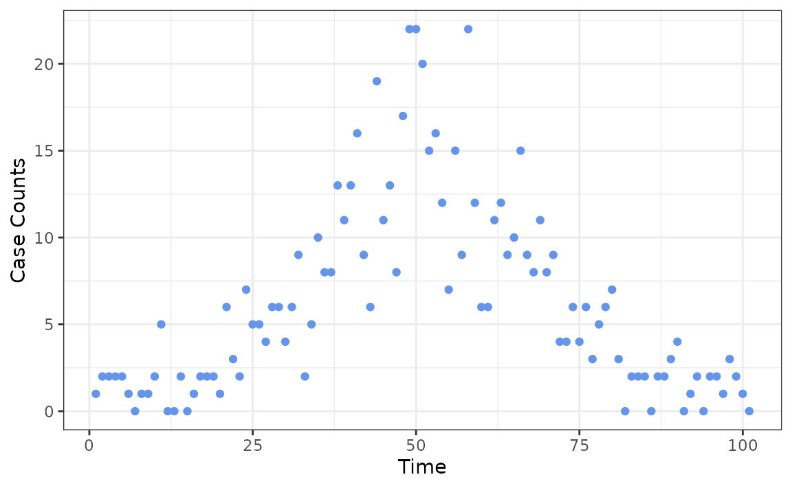
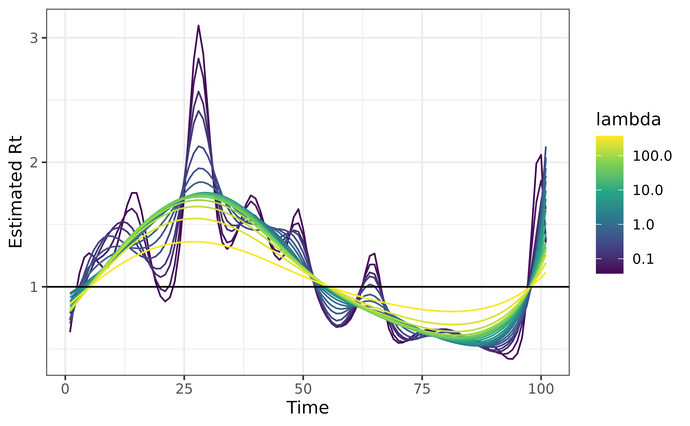
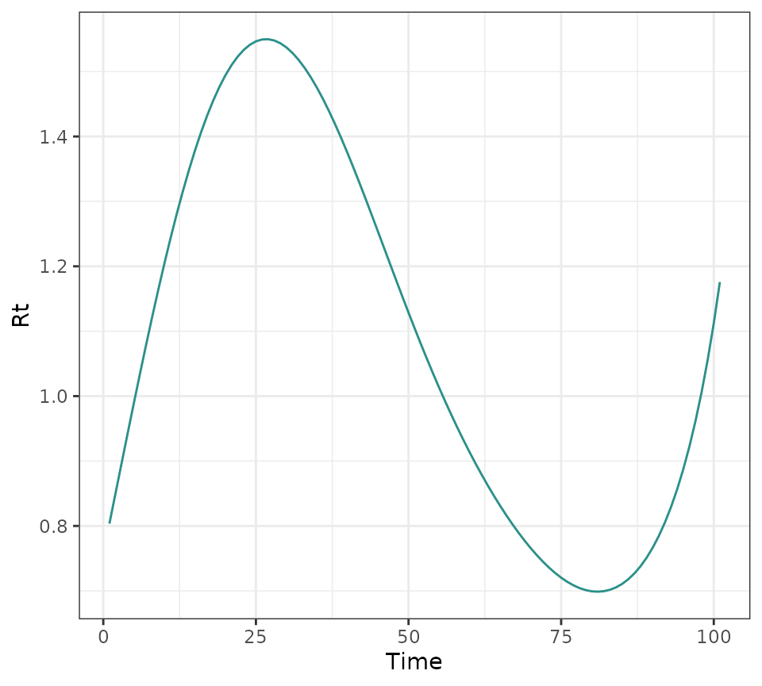
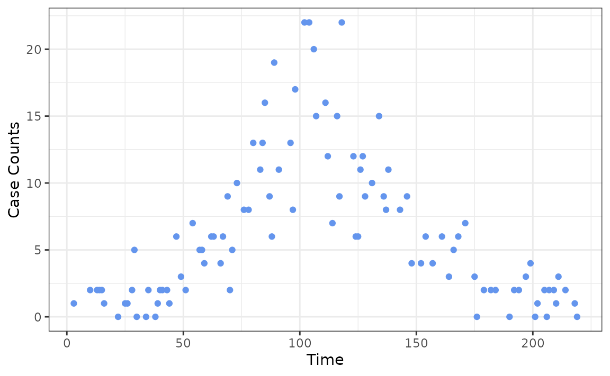
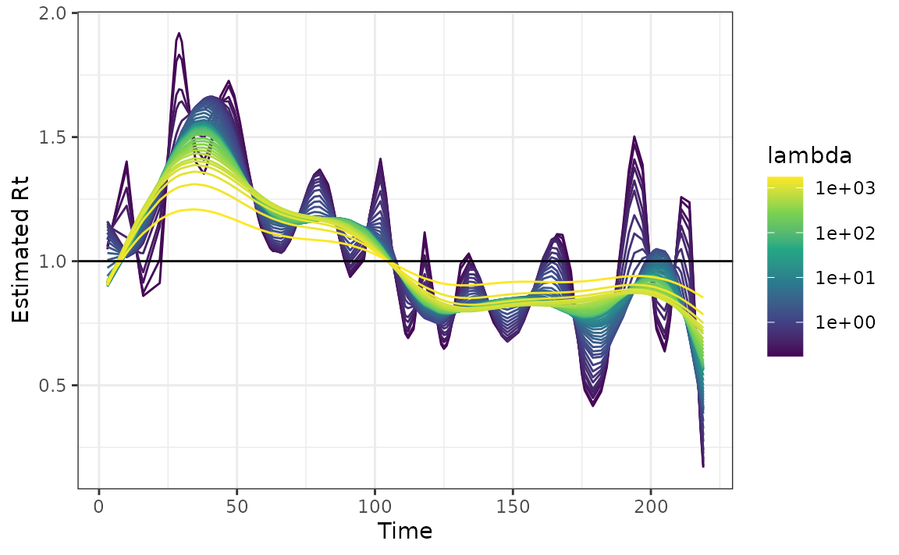
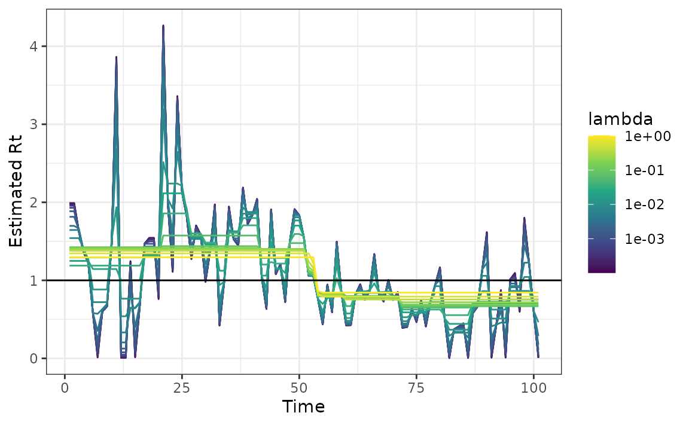
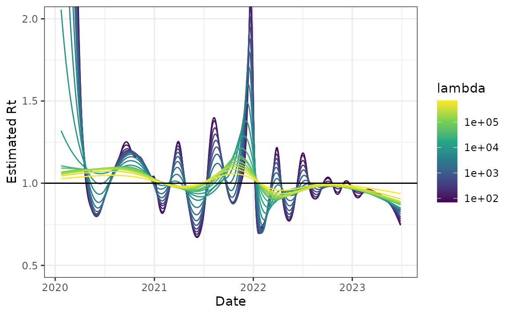
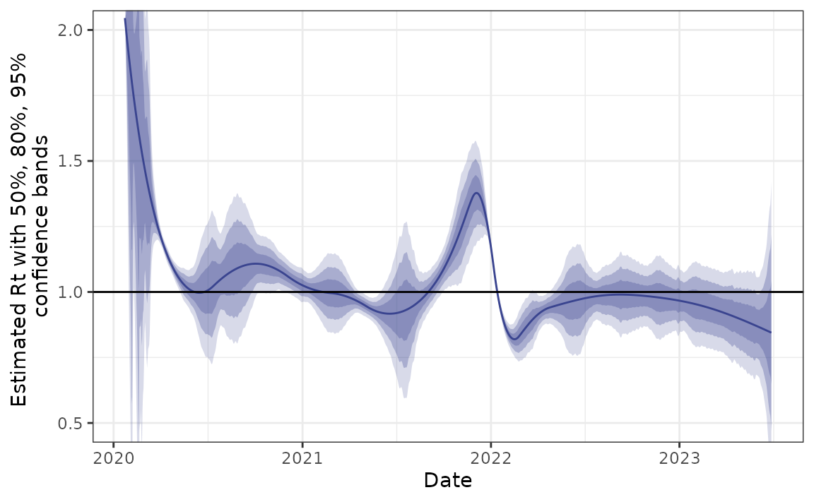

# rtestim Package Vignette

``` r
library(rtestim)
library(ggplot2)
theme_set(theme_bw())
```

## Overview

This package uses Poisson likelihood with trend filtering penalty (a
type of regularized nonparametric regression) to estimate the effective
reproductive number, \\R_t\\. This value roughly says “how many new
infections will result from each new infection today”. Values larger
than 1 indicate that an epidemic is growing while those less than 1
indicate decline.

This vignette provides a few examples to demonstrate the usage of
[rtestim](https://github.com/dajmcdon/rtestim) to estimate the effective
reproduction number, \\R_t\\.
[rtestim](https://github.com/dajmcdon/rtestim) finds a sequence of
\\R_t\\, \\\\R_t\\\_{t=1}^n\\ of an infectious disease by solving the
following penalized Poisson regression \\\begin{equation}
\label{eq:objective_fn} \hat{\theta} =
\mathop{\mathrm{argmin}}\_{\theta} \frac{1}{n} \sum\_{t=1}^n
\left(e^{\theta\_{t}}x_t - y_t\theta\_{t}\right) + \lambda \Vert
D^{(k+1)} \theta \Vert_1 \end{equation}\\ where \\y_t\\ is the an
epidemic signal, ideally, incident infections, but most frequently,
incident cases, on day \\t\\, \\\theta\_{t} = \log(R_t)\\ is the natural
logarithm of \\R_t\\ at time \\t\\, \\D^{(k)}\\ is the \\k\\-th order
divided difference operator (\\k \geq 0\\). The penalty \\\Vert
D^{(k+1)} \theta \Vert_1\\ imposes smoothness on the solution and
\\\lambda\\ controls the level of this smoothness, with larger
\\\lambda\\ resulting in smoother estimates.

In particular \\\begin{equation} x_t = \sum\_{a = 0}^m y\_{t-a} w_a
\end{equation}\\ is the weighted sum of previous incidence at \\t\\,
calculated by convolving the preceding \\m\\ days of new infections with
the discretized serial interval distribution \\w\\ of length \\m\\. This
delay distribution encapsulates the duration of time that a previous
infection is likely to lead to future infection.

To compute \\\\R_t\\\_{t=1}^n\\ with
[rtestim](https://github.com/dajmcdon/rtestim), the minimal information
needed is the new case counts at days up until \\t\\ and a parametric
form for the serial interval distribution (a Gamma density). By default,
\\2.5\\ is used for both the scale and shape parameters, based on the
literature on contract tracing, representing the typical delay between
case onsets. This is discretized to be supported on the integers. The
order of the difference operator, the degree of smoothness, defaults to
\\3\\. The sequence of smoothness penalty \\\lambda\\, if no \\\lambda\\
is provided, is calculated internally by the algorithm.

## Example - synthetic dataset

### Quick start

We first demonstrate the usage of the package on synthetic data, where
the new daily case counts are generated from a Poisson distribution with
mean parameter that roughly follows a wave. Note that the first
observation must be strictly larger than 0.

``` r
set.seed(12345)
case_counts <- c(1, rpois(100, dnorm(1:100, 50, 15) * 500 + 1))
ggplot(data.frame(x = 1:101, case_counts), aes(x, case_counts)) +
  geom_point(colour = "cornflowerblue") +
  labs(x = "Time", y = "Case Counts")
```



Next, we fit the model and visualize the resulting \\\\R_t\\\_{t=1}^n\\:

``` r
mod <- estimate_rt(observed_counts = case_counts, nsol = 20)
plot(mod)
```



[rtestim](https://github.com/dajmcdon/rtestim) estimates a spectrum of
\\\\R_t\\\_{t=1}^n\\s for a range of \\\lambda\\ values, where each
\\\\R_t\\\_{t=1}^n\\ corresponds to a specific \\\lambda\\ value. If no
\\\lambda\\ value is supplied by the user,
[rtestim](https://github.com/dajmcdon/rtestim) will automatically
calculate a sequence of \\\lambda\\ values. The additional parameter
`nsol = 20` specifies the number of \\\lambda\\s for which the
\\\\R_t\\\_{t=1}^n\\ is calculated

### Cross Validation

[rtestim](https://github.com/dajmcdon/rtestim) also provides a cross
validation procedure for selecting the amount of smoothness to be used
in the final estimate (leave-every-k-th-out cross validation).
Minimizing this metric, in principle, balances prediction error and
smoothness (`lambda.min`) though if smoother estimates are desired, one
can instead use `lambda.1se`, the largest value of \\\lambda\\ within
one standard error of the minimum.

``` r
mod_cv <- cv_estimate_rt(observed_counts = case_counts)
```

The following command plots the cross validation errors for each
\\\lambda\\ in ascending order.

``` r
plot(mod_cv)
```


The plot above displays vertical lines that correspond to the
cross-validation scores for specific values of \\\lambda\\. The blue
point at the center of each line represents the mean score for that
value of \\\lambda\\ across all cross-validation folds. The top and
bottom caps of each line indicate one cross-validation standard error
above and below the mean score for the given value of \\\lambda\\ across
all cross-validation folds. Two special values of \\\lambda\\’s are
highlighted with dashed lines. The one on the left represents the
\\\lambda\\ that gives minimum mean cross-validated error, called
`lambda.min`, and the one on the right gives the most regularized model
such that the cross-validated error is within one standard error of the
minimum, called `lambda.1se`.

Users may wish to visualize the particular \\\\R_t\\\_{t=1}^n\\ which
minimizes the cross-validation error while prioritizing smoothness.

``` r
plot(mod_cv, which_lambda = "lambda.1se")
```



### Uneven Reporting Frequency

Ideally, case counts are observed at regular intervals, such as daily or
weekly, but this is not always the case.
[rtestim](https://github.com/dajmcdon/rtestim) also accommodates
scenarios in which cases are reported with uneven intervals. To
demonstrate this, we generate a sequence of integers representing the
days at which we observe the case counts.

``` r
observation_incr <- rpois(101, lambda = 2)
observation_incr[observation_incr == 0] <- 1
observation_time <- cumsum(observation_incr)
ggplot(data.frame(x = observation_time, case_counts), aes(x, case_counts)) +
  geom_point(colour = "cornflowerblue") +
  labs(x = "Time", y = "Case Counts")
```



We can then fit the model by passing the observation time point as `x`.

``` r
mod <- estimate_rt(observed_counts = case_counts, x = observation_time)
plot(mod)
```



### Changing degree of difference operator

The degree of the estimated penalized Poisson regression function \\k\\
defaults to 3 for the algorithm, which corresponds to a piece-wise cubic
estimate \\\\R_t\\\_{t=1}^n\\. To estimate \\\\R_t\\\_{t=1}^n\\ with
piece-wise constant curves for example, use the command

``` r
mod <- estimate_rt(observed_counts = case_counts, korder = 0, nsol = 20)
plot(mod)
```



## Example - Canadian Covid-19 cases

Finally, we use a long history of real case counts in Canada. The data
is available from [opencovid.ca](https://opencovid.ca) and the version
downloaded on 4 July 2023 is included in the package. We use this data
to estimate \\R_t\\.

``` r
can <- estimate_rt(
  observed_counts = cancovid$incident_cases,
  x = cancovid$date,
  korder = 2,
  nsol = 20,
  maxiter = 1e5
)

plot(can) + coord_cartesian(ylim = c(0.5, 2))
```



### Approximate confidence bands

We also provide functionality for computing approximate confidence bands
for Rt based on normal approximations and the delta method. These are
intended to be fast and to provide some idea of uncertainty, but they
likely don’t have guaranteed coverage.

``` r
can_cb <- confband(can, lambda = can$lambda[10], level = c(.5, .8, .95))
can_cb
```

    #> An `rt_confidence_band` object.
    #> 
    #> * type = Rt 
    #> * lambda = 8320.382 
    #> * degrees of freedom = 10 
    #> 
    #> # A tibble: 1,253 × 7
    #>      fit `2.5%` `10.0%` `25.0%` `75.0%` `90.0%` `97.5%`
    #>    <dbl>  <dbl>   <dbl>   <dbl>   <dbl>   <dbl>   <dbl>
    #>  1  2.00  0.837    1.24    1.60    2.40    2.76    3.16
    #>  2  1.98  0.922    1.29    1.62    2.34    2.67    3.04
    #>  3  1.96  0.940    1.29    1.61    2.31    2.63    2.98
    #>  4  1.94  0.899    1.26    1.58    2.30    2.62    2.98
    #>  5  1.92  0.832    1.21    1.55    2.30    2.64    3.02
    #>  6  1.91  0.766    1.16    1.51    2.30    2.65    3.05
    #>  7  1.89  0.710    1.12    1.48    2.29    2.66    3.07
    #>  8  1.87  0.661    1.08    1.45    2.29    2.66    3.08
    #>  9  1.85  0.615    1.04    1.43    2.28    2.66    3.09
    #> 10  1.84  0.563    1.00    1.40    2.27    2.67    3.11
    #> # ℹ 1,243 more rows

``` r
plot(can_cb) + coord_cartesian(ylim = c(0.5, 2))
```


